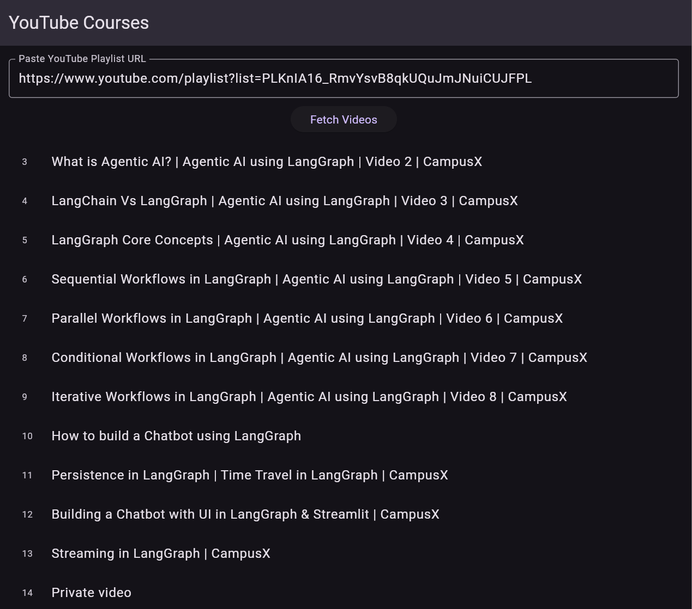

# BuJo : Your Personal Productivity App

This is a productivity app built with Flutter to manage daily tasks and build habits. It's fast, simple, and works completely offline.

### The BuJo app has the following features:

- **Full Task Management**: You can create, edit, and delete tasks.
- **Priority System**: Assign High, Medium, or Low priority to each task to see what's important.
- **Habit Tracker**: Define daily habits and track your progress.
- **Interactive Calendar**: A full calendar heatmap shows your completion history for any selected habit.
- **Automatic Streaks**: The app automatically calculates your current and longest streaks to keep you motivated.
- **Pomodoro Focus Timer**: A built-in timer (25 min focus, 5 min break) to help you concentrate.
- **YouTube Playlist Importer**: Paste a playlist URL to fetch all video titles and use it as a course tracker.
- **100% Offline**: All your data is saved securely on your device.

### Tech Stack:

- **Framework**: Flutter
- **State Management**: Provider
- **Local Database**: Hive
- **UI Packages**: `table_calendar`, `percent_indicator`
- **API Calls**: `http`

### How to Run This Project:

1. **Get Packages:**
    
    ```
    flutter pub get
    
    ```
    
2. **Run Code Generator (Important for Database):**
    
    ```
    flutter packages pub run build_runner build --delete-conflicting-outputs
    
    ```
    
3. **Run the App:**
    
    ```
    flutter run
    ```